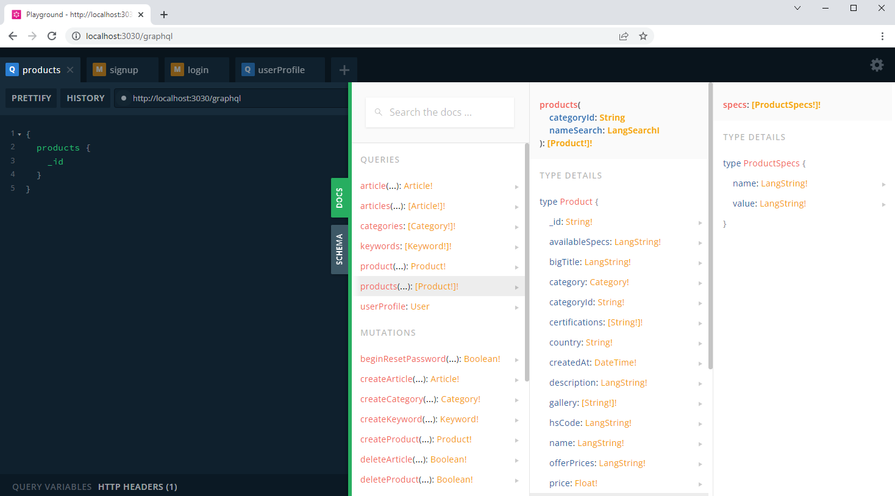

# API Documentation  

## Restful APIs

### `/auth/google`
use this to make the user authenticate (login/sign up) via Google. after the authentication he/she will be redirected to one of the following two urls:

- `$AUTH_FRONTEND_URL/signup?pendingUserToken=$token&fullName=$fullName` (if user doesn't have an account. he/she will be re-directed to this page to finalize the sign up on this page)
- `$AUTH_FRONTEND_URL/` (if user already have an account, so this is a login, he will be re-directed to the frontend home page)

> e.g. see the [TRU market frontend (backend-integration branch)](https://github.com/Alessandro0504/tru-market/tree/backend-integration) how it integrated Google Auth

### `/files/upload`
use this endpoint to upload files. This endpoint accept an array of uploading files (images and videos only) under `files` field name. (only admin can upload)

> e.g. see the [TRU market frontend (backend-integration branch)](https://github.com/Alessandro0504/tru-market/tree/backend-integration) how it integrated the Files uploading.

## GraphQL APIs
for the GraphQL APIs docs, [run the app in the development](./development.md) then open `/graphql` in the browser (e.g. `http://localhost:3030/graphql`).

**GraphQL Playground**

